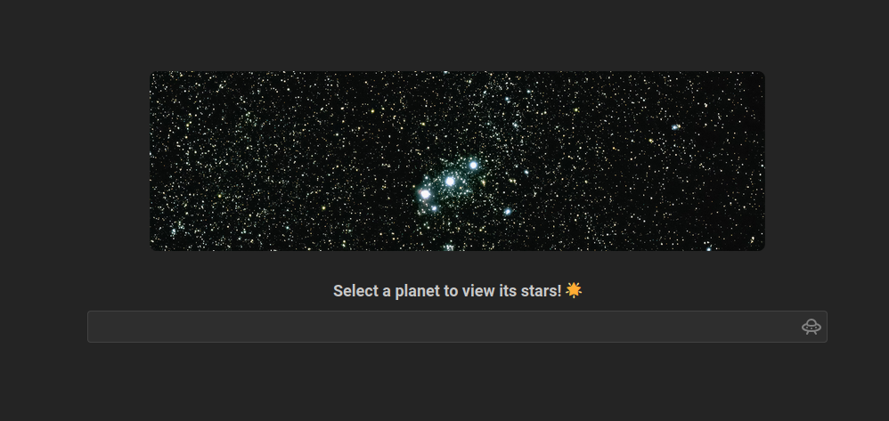
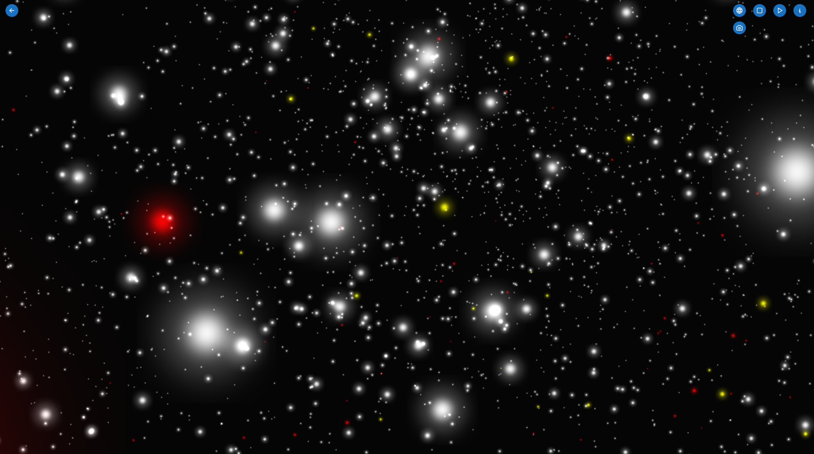

# NASA Space Apps Challenge 2024

We choose the challenge [Exosky!](https://www.spaceappschallenge.org/nasa-space-apps-2024/challenges/exosky/).
The result is hosted on [soymilk.lueng.org](https://soymilk.lueng.org)

The frontend source is on the [front branch](https://github.com/pblop/hackathon2024/tree/front), the backend source is on the [api branch](https://github.com/pblop/hackathon2024/tree/api).

